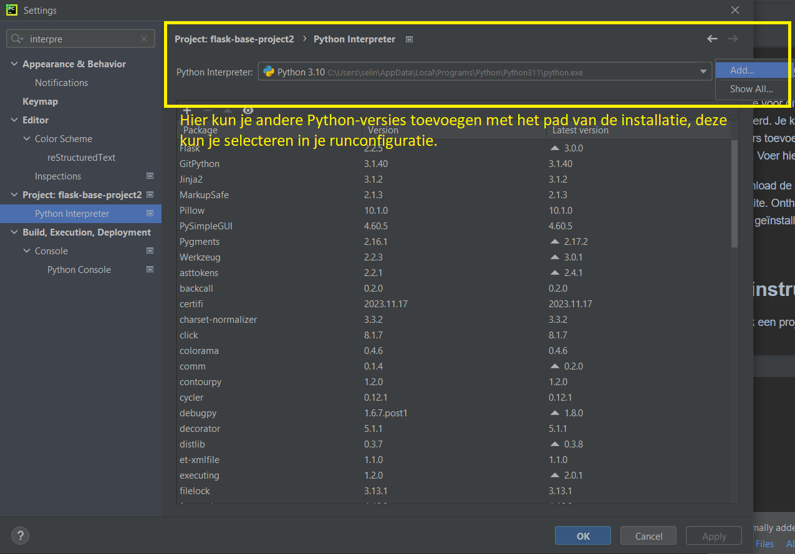
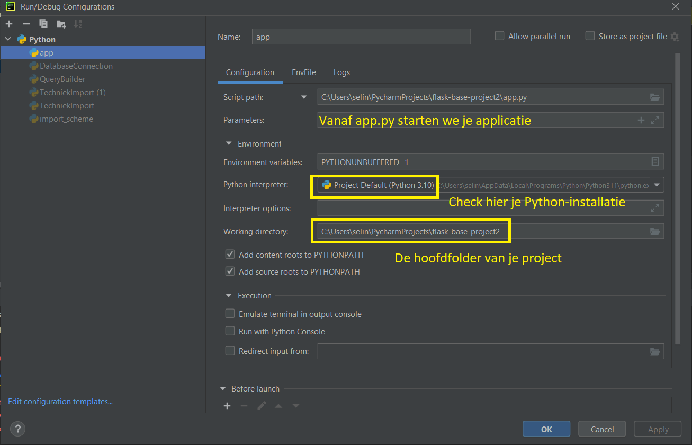

# Flask Base Project

Dit is een Flask basisproject voor Python 3.10.

## Installatie

Zorg dat je voor dit project Python 3.10 hebt geïnstalleerd. 
Je kunt verschillende Python interpreters toevoegen in je verschillende projecten. 
Voer hiervoor de volgende stappen uit:

1. Download de gewenste Python-versie via de website. Onthoud goed waar op je computer deze geïnstalleerd wordt.
2. Zorg dat de gewenste Python-interpreter toegepast wordt binnen je project.

In PyCharm kun je dit bijvoorbeeld doen in de settings van je editor.

## Uitvoeren in PyCharm

1. Maak een project aan (bijvoorbeeld door dit project te klonen vanaf Git)
2. Installeer de benodigde libraries met `pip install -r requirements.txt`.
3. Maak de run-configuratie aan in PyCharm.

Met de volgende configuratie zou je je applicatie moeten kunnen starten. Er komt dan aardig wat 
tekst voorbij in de terminal, waaronder een link die er (ongeveer) uit ziet als `http://127.0.0.1:5000/`. 
Via deze URL kun je vervolgens je applicatie bekijken.

Notitie: dit project bevat ook een Docker-file om te runnen in containers en deployment te vergemakkelijken. 
Zie hiervoor ook [Docker's Tutorial](https://www.docker.com/101-tutorial/).